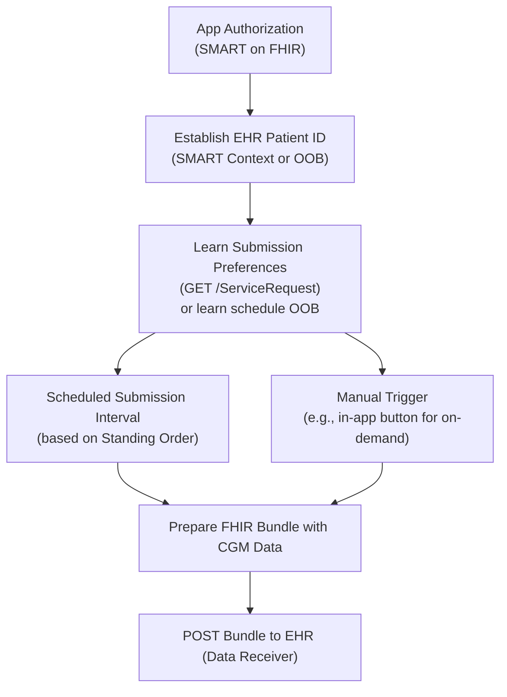

```mermaid
flowchart TD
AppAuth["App Authorization\n(SMART on FHIR)"]
AppAuth --> EstablishPatient["Establish EHR Patient ID\n(SMART Context or OOB)"]
EstablishPatient --> ReadSubmissionPrefs["Learn Submission Preferences\n(GET /ServiceRequest)\nor learn schedule OOB"]
ReadSubmissionPrefs --> ScheduledSubmission["Scheduled Submission Interval\n(based on Standing Order)"]
ScheduledSubmission --> PrepareFHIRBundle["Prepare FHIR Bundle with CGM Data"]
ReadSubmissionPrefs --> ManualTrigger["Manual Trigger\n(e.g., in-app button for on-demand)"]
ManualTrigger --> PrepareFHIRBundle
PrepareFHIRBundle --> PostBundleToEHR["POST Bundle to EHR (Data Receiver)"]
```

